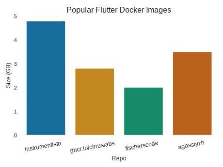
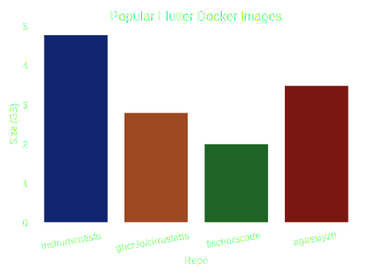

Recently, I had the pleasure of starting a flutter project. As nice as it is to work with flutter, the docker images available are *huge*:

{: .light }
{: .dark }
_A comparisson of the image sizes of four of the most popular flutter images on [DockerHub](https://hub.docker.com/search?q=flutter)_

Several GB aren't fast to pull, especially when you want quick and clean development cycles and pipelines. Which is why I decided to do it myself!

## What To Expect From This

Before you start copy-pasting everything from here, I think it's only fair you know what you're getting in to. This tutorial is only aimed at flutter web! If you're building a native application for, say, android, linux, or mac, this one won't work for you. The reason why I only focused on flutter's web components has to do with me disliking javascript  and wanting to learn flutter.

In addition, this tutorial assumes you have basic knowledge of docker. If the terms build and multi-stage build aren't familiar for you, that knowledge base might need some brushing up. That being said, without further ado, lets go!

## Initial Dockerfile

```Dockerfile
# flutter v3.27.1
FROM ghcr.io/cirruslabs/flutter@sha256:912e71e01620c26a5bdacfffe8d00d053802aee956802ab08b250ece498b442a AS build
WORKDIR /frontend
COPY lib ./lib
COPY web ./web
COPY pubspec.yaml pubspec.yaml
RUN flutter build web
EXPOSE 42069
CMD [ "flutter", "run", "-d", "web-server", "--web-hostname=0.0.0.0", "--web-port=42069" ]
```

> Your `Dockerfile` needn't be such detailed. You can leave the digest out and just `COPY . .`, but I am trying to uphold best practices here!
{: .prompt-info }

The idea of the `Dockerfile` is straight-forward: take the image, copy the files you need, build and run. You can build this via `docker build -t <tag> .` and run via `docker run -p 42069:42069 <tag>`.

The size of the image built is a staggering 3.18GB. One way to reduce the image size is removing unnecessary stuff. Our base flutter image also contains the SDKs for Android and other platforms, which add up to a lot. We could remove those parts explicitly, OR we could benefit from docker's multi-stage builds.

## Multi-Stage Docker

```Dockerfile
# flutter v3.27.1
FROM ghcr.io/cirruslabs/flutter@sha256:912e71e01620c26a5bdacfffe8d00d053802aee956802ab08b250ece498b442a AS build
WORKDIR /frontend
COPY lib ./lib
COPY web ./web
COPY pubspec.yaml pubspec.yaml
RUN flutter build web
# nginx v1.27.3
FROM nginx@sha256:fb197595ebe76b9c0c14ab68159fd3c08bd067ec62300583543f0ebda353b5be AS deploy
EXPOSE 42069
COPY --from=build /frontend/build/web /usr/share/nginx/html
CMD ["/usr/sbin/nginx", "-g", "daemon off;"] 
```

Compared to the [first attempt](#initial-dockerfile), this one initially creates the files necessary for the web application and then proceeds to host those in an nginx server. Do not let the name of the target directory fool you! This one contains all HTML, JS and asset files your application needs to run! One can even serve dynamic websites by this logic! You can build and run this the same way as before, but beware to provide `42069:80` in the port-mapping! This is because the nginx image listens on port 80 by default, and changing that requires touching the `nginx.conf` .

> A seasoned docker enthusiast might point out that the `Dockerfile` shown here is not the shiniest multi-stage build out there. That is true: one could also split the first stage into two by building the dependencies in the `pubspec.yaml` first, copying them over to the new stage and then building the web application files.
{: .prompt-tip }

The resulting image size is 215MB! It is a significant drop from before, but we can do better! This is mostly motivated by the fact that the actual `./build/web` directory is about 23MB in size. Even when accounting for system libraries, the gap is too big to be left unchecked!

## Distroless

```Dockerfile
FROM ghcr.io/cirruslabs/flutter@sha256:912e71e01620c26a5bdacfffe8d00d053802aee956802ab08b250ece498b442a AS build
WORKDIR /frontend
COPY lib ./lib
COPY web ./web
COPY pubspec.yaml pubspec.yaml
RUN flutter build web

FROM nginxinc/nginx-unprivileged@sha256:0abb7c408e90f9b2264fd51a9c9525f7a88be5286d040968dddd8534515910bd AS temp
COPY --from=build /frontend/build/web /usr/share/nginx/html

FROM gcr.io/distroless/base-debian12:nonroot@sha256:6d4a4f40e93615df1677463ca56456379cc3a4e2359308c9e72bc60ffc4a12a9
COPY --from=temp /lib/x86_64-linux-gnu/libdl.so.2 /lib/x86_64-linux-gnu/libdl.so.2
COPY --from=temp /lib/x86_64-linux-gnu/libc.so.6 /lib/x86_64-linux-gnu/libc.so.6
COPY --from=temp /lib/x86_64-linux-gnu/libz.so.1 /lib/x86_64-linux-gnu/libz.so.1
COPY --from=temp /lib/x86_64-linux-gnu/libcrypt.so.1 /lib/x86_64-linux-gnu/libcrypt.so.1
COPY --from=temp /lib/x86_64-linux-gnu/libpthread.so.0 /lib/x86_64-linux-gnu/libpthread.so.0
COPY --from=temp /lib64/ld-linux-x86-64.so.2 /lib64/ld-linux-x86-64.so.2
COPY --from=temp /usr/lib/x86_64-linux-gnu/libssl.so.3 /usr/lib/x86_64-linux-gnu/libssl.so.3
COPY --from=temp /usr/lib/x86_64-linux-gnu/libpcre2-8.so.0 /usr/lib/x86_64-linux-gnu/libpcre2-8.so.0
COPY --from=temp /usr/lib/x86_64-linux-gnu/libcrypto.so.3 /usr/lib/x86_64-linux-gnu/libcrypto.so.3
COPY --from=temp /usr/sbin/nginx /usr/sbin/nginx
COPY --from=temp /var/log/nginx /var/log/nginx
COPY --from=temp /etc/nginx /etc/nginx
COPY --from=temp /etc/passwd /etc/passwd
COPY --from=temp /etc/group /etc/group
COPY --from=temp /usr/share/nginx/html /usr/share/nginx/html

EXPOSE 8080
USER nginx
ENTRYPOINT ["/usr/sbin/nginx", "-g", "daemon off;"] 
```

Compared to the [second attempt](#multi-stage-docker), this `Dockerfile` has another stage. The last stage copies over only the necessary library files the nginx binary needs to run . A keen eye might have noticed that I changed my nginx image from the default one to `nginx-unprivileged`. This was due to nginx creating some files with some specific permissions in its stage, which became inaccessible in the distroless stage. The rationale behind this has to do with the ACL system and air-tight security guarantees the distroless containers provide.  

The size of this image is 46.3MB! This is an almost **70x** reduction of the original image size of 3.18GB!

## Further Work

Faced with the frustration of `Permission Denied`, I drew the line here. However, someone brave might pick up where I left off and embark on the dangerous quest of starting `FROM scratch`. This endeavor would require taking some specific libraries from the distroless image. Despite this, the ambitious adventurer is motivated to question the sanity and the gain from this quest. As it stands, the actual application files take up about 50% of the end image size. Finding something "useless" in the remaining 23MB might prove too difficult. Despite this, I am looking forward to your thoughts and comments about alternative approaches, or just questions or feedback in general! :D

## References


