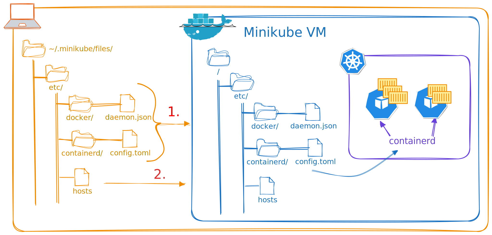

If you're new to kubernetes and want to learn by getting your hands dirty, minikube is one of the ways to go. 
However, as soon as you want to play around with different environments and virtualization technologies, the concepts of drivers and runtimes pop up.

## What to expect from this

This article gives an overview of the different alternatives available when it comes to picking a driver or runtime for a minikube cluster. It will not go into detail on all of them, but rather focus on the underlying concept and explain that. I would also like to point out that these are my own opinions, if not noted otherwise. I have however, tried to do my own research on the topic. You can thus understand this document as a summary of the knowledge I have gathered thus far. When reading these notes, it is expected you have a good grasp of virutalization and the minikube CLI itself.

## Runtimes

> A runtime is what will start the containers in the cluster. It describes the application used to spin up the cluster containers.
{: .prompt-info }

There are 3 ways to start containers (more if you're wearing fancy-pants). I will delve into each one in the following.

### containerd

An industry-standard container runtime with an emphasis on simplicity, robustness, and portability . It can manage the complete container lifecycle of its host system: image transfer and storage, container execution and supervision, low-level storage and network attachments . This makes `containerd` a suitable candidate for running containers for a cluster. To do this, the `cri` plugin is needed. This is an implementation of the Container Runtime Interface (CRI), which is used to talk to a kubernetes cluster. Luckily, this is natively included in `containerd`!

However, `containerd` hasn't been that friendly to new users according to my experience. It is much rather used for communication between applications. Luckily, a user won't have that much to do with the runtime. On those few times that some debugging will have to ensure, `crictl` is a good tool to help: it provides fine-grained controls and a lot of information, if queried correctly.

If you start your cluster with `--container-runtime=containerd` and `ssh` into it, you can see `containerd` in action. Just take a look at the currently running processes! There's a lot from `containerd`! Well, actually from the `containerd-shim`. This is a process spawned by `containerd` to take care of the containers. It serves as the parent process for many containers, such as the kube-scheduler, kube-api-server and the kube-control-manager. You can tell by looking at the PIDs:

```logs
root        1150       1  /usr/bin/containerd-shim-runc-v2 -namespace k8s.io -id a50c72cea59a8fb096bd4892c5cc488d90cc7fc9e1305f9e6c562c7253490792 -address /run/containerd/containerd.sock
...
root        1318    1150  kube-scheduler --authentication-kubeconfig=/etc/kubernetes/scheduler.conf --authorization-kubeconfig=/etc/kubernetes/scheduler.conf --bind-address=127.0.0.1 --kubeconfig=/etc/kubernetes/scheduler.conf --leader-elect=false
```
_Notice how the process with the PID 1150 spawned 1318, which happens to be the kube-scheduler. Other than that, don't worry about the `runc-v2` part: that deserves a whole other blog!_

The `containerd-shim` exposes and API that is queried by `containerd` to manage the containers.

### docker

Ah yes, the user-friendly tool we all know and love! One can also use `docker` as the runtime for the cluster. It is also the minikube default! However, bear in mind that `docker` itself uses `containerd` under the hood. After all, `containerd` was part of `docker` a long long time ago. You can verify this by looking at the processes spawned in a cluster working with the `docker` runtime. You will see a similar picture as before, but there will also be these two processes:

```logs
/usr/bin/dockerd -H tcp://0.0.0.0:2376 -H unix:///var/run/docker.sock --default-ulimit=nofile=1048576:1048576 --tlsverify --tlscacert /etc/docker/ca.pem --tlscert /etc/docker/server.pem --tlskey /etc/docker/server-key.pem --label provider=docker --insecure-registry 10.96.0.0/12
...
/usr/bin/cri-dockerd --container-runtime-endpoint fd:// --pod-infra-container-image=registry.k8s.io/pause:3.10 --network-plugin=cni --hairpin-mode=hairpin-veth
```

The first one, `dockerd` follows a similar logic to the `containerd-shim`. However, the other one, `cri-dockerd` has enterred the game fairly recently. It fulfills the same purpose that `cri` does for `containerd`: it provides `docker` with an extendable and fully CRI-compliant plugin. It was Miranti's (the guys that "own" docker now), solution to the Kubernetes project dropping support for the `docker` shim back in v1.24. Up until that point, that shim was maintained by the kubernetes team.

The `cri-dockerd` binary is not included as a docker plugin by default and has to be downloaded extra. Another worry about this plugin is that it increases dependencies on other companies.

### cri-o

This is a Lightweight Container Runtime made for Kubernetes. It was developed by RedHat, thus is has a keen focus on security. However, other than that, it doesn't have much more to offer. It has a similar performance and memory footprint like `containerd` and is also fully `CRI`-compliant.

## Drivers

> A driver is what the cluster will run on. It describes what provides the essential libraries, the object files and _other-stuff_ needed to run the processes of the cluster and the runtime.
{: .prompt-info }

It does not refer to the application dependencies! The definition above really refers to the underlying stuff the runtime needs to spin up the containers for the pods. Bear in mind that the pods will run as a container, no matter what driver is used. To reiterate, the driver merely provides the necessary tools to start those containers. As you can imagine, there are some ways to do that. In the following, I will go through groups of drivers based on the underlying technology.

### VMs

The cluster runs on a virtual machine. For this, some sort of virtualization tool is necessary. Currently available VM-based drivers supported by minikube include VirtualBox, QEMU, and KVM2. Those tools need an image to load up. Minikube hand-crafted a minimalistic [iso](https://minikube.sigs.k8s.io/docs/contrib/building/iso/) especially for this purpose. Due to the keen attention to detail, that VM image is only about 280MB, is downloaded if not present and actually uses less CPU cycles than the docker driver . The way they build the image can be found [here](https://github.com/kubernetes/minikube/tree/master/deploy/iso/minikube-iso).

To configure aspects of the VMs, you can provide corresponding config files. An example of the directories in question is shown in a picture below. The example is for another type of driver, but the mechanisms are applicable here as well.

### Containers

The cluster runs on containers. For this, some sort of containerization tool is necessary. Currently available container-based drivers supported by minikube include `docker` and `podman`. Those usually allow starting a container within a container (i.e. [Docker in Docker](https://www.docker.com/resources/docker-in-docker-containerized-ci-workflows-dockercon-2023/)). The image loaded in those running containers is built from [this](https://github.com/kubernetes/minikube/blob/master/deploy/kicbase/Dockerfile) Dockerfile. Bear in mind that the developers start from a `scratch` image on the last stage, so `bash`-ing into the container for debugging purpose proves rather difficult (at least for me). Anyhow, spinning up the pods isn't an issue. For me, visualizing how the parts play together was a bigger problem:

{: .light }
{: .dark }
_An [excalidraw](https://excalidraw.com/) sketch_

This sketch depicts the local PC running a minikube cluster (orange). The command to start this specific cluster was `minikube start --driver=docker --container-runtime=containerd`. This means that the cluster will run on a container (blue) started by `docker`. *In that container*, the pods will be managed by `containerd` (purple).

One way to configure many internal tools in that container are through config files. The way to provide those config files is to add them via the `~/.minikube/files` directory. The path used there must be the same as the one expected from the tool you are trying to configure. All that directory including subdirectories is read **once** when minikube starts the cluster. Later changes aren't reflected, unless one starts the cluster again. However, that could lead to conflicting profiles and isn't recommended. This adresses the number 1 on the picture. 

Number 2 is about changing the `/etc/hosts` files of the cluster. The only way I found to do this is via `ssh`-ing into the cluster and actually changing it. One application of this is to make the minikube guest accessible from the host it is running on. This could make access to a private or locally running registry easier. Since minikube changes the `/etc/hosts` file during startup, there is no guarantee that the old content will remain. Thus, it is wiser to edit it later.

> I do mention the directory `~/.minikube/files`, but that is heavily reliant on how you started the minikube cluster. If you started it as your user, then that is the directory for you. However, if you started it as root, `/.minikube/files` is the correct choice. This is due to minikube saving the profile on the home directory of the user it is run on. Calling minikube commands from other users will lead to a profile not found.
{: .prompt-warning }

### None

With the decreasing degree of virtualization, it only makes sense to have a driver without any virtualization. Using the none driver means that the cluster is running directly on your machine: no VM or container in between! Sometimes this is also adressed as a cluster running on bare-metal. This driver requires root permissions, as minikube needs to make changes to the filesystem, spawn processes and manage them. It also goes without saying that this driver will make changes to your system that you probably won't be aware of. This is why this driver is recommended for experienced users.

So you might (rightfully so) be contemplating the existance of such driver. For this, I want to draw your attention towards the could. With different cloud providers offering computing resources and servers, a lot of virtualization takes place. Thus, you typically get some sort of VM when signing a contract with your cloud provider. In those cases, sppinning up another VM is usually prohibited and disabled. Spinning up a container seems like an overkill, since you are already in a VM. This is where the none driver shines the brightest. With an unmatched performance and comparably reliable functionality, the none driver is a good fit for the cloud.

However, as most things cloud-related, there's a caveat: Minikube hasn't tested a start configuration including the none driver and the `containerd` runtime. This is also clearly shown in the logs. It works on my garuda (an arch based distribution), but not on a Debian 12 machine. Luckily, this is only an issue on the latest versions of kubernetes and minikube, so there is hope for this to get fixed or at least properly documented in the near future.

## Conclusion

So, you read thus far huh? Congrats and thanks for that! Here's a small recap of what I just wrote down. A runtime defines what shall start the containers in a cluster. A driver supplies the runtime with necessities for it to do its job. In addition, it sets up the environment properly. There are different drivers and runtimes out there, but not all configurations work. Reading through the docs is a good entry point for fishing out any missing details.

I hope you liked this one! If you have any questions, feel free to drop a comment below or reach out to me on my platforms! I'm looking forward to hearing from you!
 
## References


